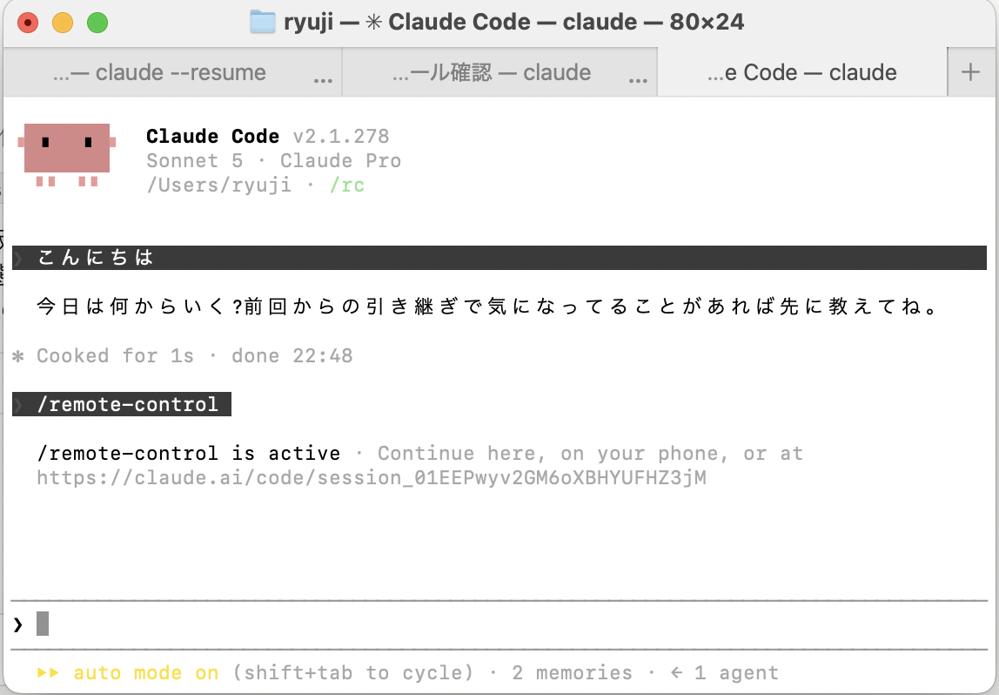
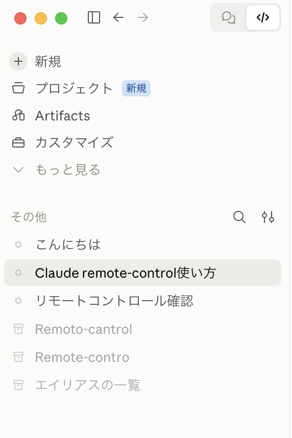

# 操作メモ

Claude Codeを複数の画面(ターミナル・VS Code・iPhone)から使う時、毎回使う操作のメモ。「今どんな場面か」で探せるように並べてある。セットアップの詳細(Tailscale・Termiusの初期設定)は`設備メモ.md`を参照。

## クイックリファレンス(コマンド一覧)

### シェル用(ターミナルの入力待ちマーク`%`に打つ、Claude起動前のコマンド)

| やりたいこと                           | コマンド                                                    |
| -------------------------------- | ------------------------------------------------------- |
| 目的のフォルダに移動する                     | `cd /Users/ryuji/sb-mac`                                |
| sb-macに移動して新規にリモート接続で起動する(エイリアス) | `remoto`                                                |
| リモート接続で新規に起動する(本来の形)             | `cd ~/sb-mac && claude remote-control`(`claude rc`でも同じ) |
| 過去のセッション一覧から選んで再開する              | `claude --resume`                                       |
| セッションIDが分かっている状態で再開する            | `claude --resume <セッションID>`                             |
| セッションIDが分かってる状態で再開する(エイリアス)      | `resume`                                                |
| 直前の会話にそのまま戻る                     | `claude --continue`                                     |

### AIチャット用(Claude起動後の会話入力欄=プロンプトに打つ)

| やりたいこと                        | コマンド              |
| ----------------------------- | ----------------- |
| 今の会話をアプリ版/WEB版からも繋げる状態にする      | `/remote-control`  |
| 設定メニューを開く(リモート自動接続のオン/オフなど)     | `/config`          |

### Finder用(キーボードショートカット、コマンドではない)

| やりたいこと                | キー操作            |
| --------------------- | --------------- |
| 隠しフォルダにジャンプする(Finder) | `Cmd + Shift + G` |
| 隠しファイルの表示切替(Finder)   | `Cmd + Shift + .` |

---

## シーン: 起動時に自動でリモート接続したい/したくない時(設定ファイル)

Claude Codeには、**「新しくターミナル版クロードを起動するたび、自動でリモート接続もオンにするか」**を決める、Mac全体に効く設定がある。

**設定ファイルの場所:** `~/.claude/settings.json`

**中身:**
```json
{
  "theme": "dark",
  "remoteControlAtStartup": true
}
```

- `"remoteControlAtStartup": true` → 起動するたび、最初から自動でスマホ/PC版・WEB版から繋げる状態になる(`/remote-control`を毎回打つ手間が省ける)
- `"remoteControlAtStartup": false` → 普段は繋がってない状態で起動し、繋げたい時だけ自分で`/remote-control`と打つ

(2026-09-21時点: `true`に設定済み)

**注意:** これは「他人が勝手に操作できるようになる」という意味ではない。あくまでりゅーじ君自身の別デバイス(同じアカウントでログインしてるスマホ/ブラウザ)から繋げやすくするかどうかの、利便性の設定。

---

## シーン: `/config`コマンドで切り替えたい時

設定ファイル(`~/.claude/settings.json`)を直接編集しなくても、会話中のコマンドだけで同じ設定を切り替えられる。ファイルを手で書き換えるより、こっちの方が手軽で間違いも少ない。

1. 会話中に`/config`と打ってEnter
2. 設定メニューの画面が開く(矢印キー↑↓で項目を選ぶ形式の画面)
3. リモート接続に関する項目(起動時の自動接続についての設定)を矢印キーで選ぶ
4. Enterかスペースキーでオン/オフを切り替える
5. Escキーなどでメニューを閉じる(設定はその場で保存される)

**補足:** メニューの項目名は表記が多少違う可能性があるので、初めて操作する時は一緒に画面を見ながら該当項目を探すのが確実。

---

## シーン: `claude remote-control`(シェルから新しく繋げる)

**打つ場所:** シェルのプロンプト(まだ会話を始めてない状態、`ryuji@MacBook-Air-2 ~ %`のような画面)。

**正しい手順(本来の形):**
```
cd ~/sb-mac
claude remote-control
```
- 1行目: sb-macフォルダ(信頼済みの場所)に移動する
- 2行目: そこでリモート操作モードのClaude Codeを起動する
- `remote-control`は`rc`と省略しても同じ(`claude rc`でもOK)
- エイリアス`remoto`は、この2行を1つにまとめたショートカット

**注意: ホームディレクトリ(`~`)では動かない**

Claude Codeには「このフォルダの中では自由に動いていい」という許可(信頼)を、フォルダごとに一度だけ確認する仕組みがある。

イメージ: マンションの各部屋(フォルダ)に入る時、初めて入る部屋だけ「入っていい?」と聞かれて、OKすれば次から無審査で入れる。

- `sb-mac`フォルダ: 何度も作業してるので信頼済み
- ホームディレクトリ(`~` = `/Users/ryuji`直下): 「マンション全体」のような広すぎる場所なので、セキュリティ上**絶対に信頼済みにならない**

ホームディレクトリにいる状態で`claude remote-control`を直接打つと、以下のエラーが出る。
```
Error: Workspace not trusted. /Users/ryuji is your home directory, and for security home-directory trust is never saved, so running `claude` here first won't help. Run `claude rc` from a project directory instead (run `claude` there once to accept the trust dialog).
```
この場合は、`cd ~/sb-mac`で信頼済みのフォルダに移動してから実行すればいい。

---

## シーン: `/remote-control`(会話中にアプリ/WEB版と繋げる)

**打つ場所:** ターミナル版クロードの、**すでに会話が始まってる入力欄**(シェルのプロンプトではない)。

**打つタイミング:** すでにターミナル版クロードと話してる途中で、その続きをスマホ/PC版やWEB版からも見たい・操作したいと思った時。

**手順:**
1. ターミナル版クロードの会話入力欄に`/remote-control`と打ってEnter
2. 「`/remote-control` is active」というメッセージと、`https://claude.ai/code/session_...`のようなリンクが表示される
3. その瞬間、アプリ版/WEB版のセッション一覧に、今の会話が新しく出現する(下の画像の左サイドバーの太字部分)





**ポイント:** アプリ版のセッション一覧には、最初は何も出ていない。`/remote-control`を打った時だけ、そのタイミングでターミナル版の会話がアプリ版側に紐づいて表示される。

---

## シーン: リモートコントロールが切断された時の復元方法

**症状:** ターミナルを閉じる/PCがスリープすると、ブラウザやVS Codeの「リモート」画面に「リモートコントロールが切断されました」と出る。

**原因:** そのセッションを動かしていたMac側のClaude Codeがオフラインになっているだけ。会話データ自体は消えていない。

**直し方:** Macでターミナルを開いて以下のどれかを打つ。

- 直前の会話に戻ればいい → `claude --continue`(一番簡単)
- 過去の会話一覧から選びたい → `claude --resume`
- 会話のセッションIDが分かっている → `claude --resume <セッションID>`

打てば元のセッションが復活し、リモート側も自動で再接続される。

---

## シーン: 今いるフォルダが目的のプロジェクトと違う時

`claude --resume`や他の作業をする時、今いるフォルダ(例: ホームフォルダ`/Users/ryuji`)が、作業したいプロジェクトのフォルダ(例: `sb-mac`)と違うことがある。

**イメージ**: 家(ホームフォルダ)の玄関にいるのに、作業したいのは2階の子供部屋(sb-macフォルダ)、みたいな状態。

- 今どのフォルダにいるかは、ターミナルのプロンプト(`ryuji@MacBook-Air-2 sb-mac %`のような表示)の後ろ側で分かる
- 目的のフォルダに移動したい時:
  ```
  cd /Users/ryuji/sb-mac
  ```
  (`cd`は「Change Directory」の略)

## シーン: Finderで深い場所・隠しフォルダを開きたい時

**`Cmd + Shift + G`**(「フォルダへ移動」): Finderを開いた状態でこのキーを押すと、パスを直接入力してそのフォルダにジャンプできるダイアログが出る。`.claude`のような隠しフォルダでも、パスさえ分かればこれで一発で開ける(隠しフォルダの表示設定をオンにする必要すらない)。

例:
```
/Users/ryuji/.claude/projects/-Users-ryuji/memory/
```
と貼り付けてEnter。

**`Cmd + Shift + .`**(ピリオド): 今開いてるFinderのウィンドウ全体で、隠しファイル・隠しフォルダ(名前が`.`で始まるもの、例: `.claude`、`.obsidian`、`.git`)の表示/非表示を切り替える。もう一度押すと元に戻る。

---

## 補足: コマンド・用語の詳しい説明

### 合言葉(ショートカット)とは

この2つの言葉を言うだけで、Claudeが説明なしでコマンドだけコピペ用に出してくれる。

- **「リモート」と言うと** → `/remote-control`(VS Codeなど別画面で、吹き出し付きの見た目のまま今の会話を開く)
- **「ターミナル再開」と言うと** → `claude --resume <その時のセッションID>`(ターミナル上で文字だけの続きから話す)

**注意**: これは「言うとコマンドを出してくれる」だけで、その後コピペして打つ必要がある。一方、`resume`は`.zshrc`に登録された**alias(ショートカットコマンド)**そのもので、打った瞬間に`claude --resume`が実行され、過去のセッション一覧から選べる(2026-09-21時点。以前はキーチェーン解除+特定セッションIDへの固定だったが、シンプルな形に変更済み)。似てるけど別物。


