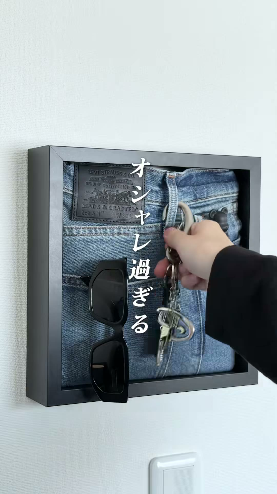
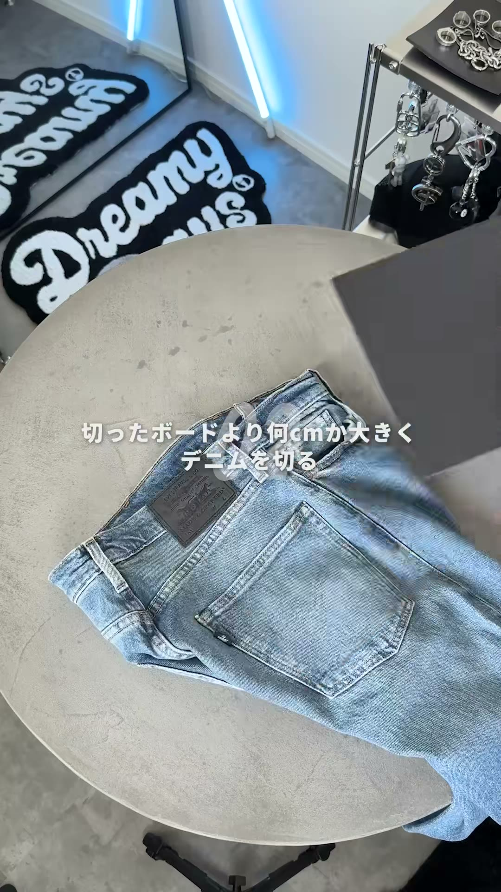
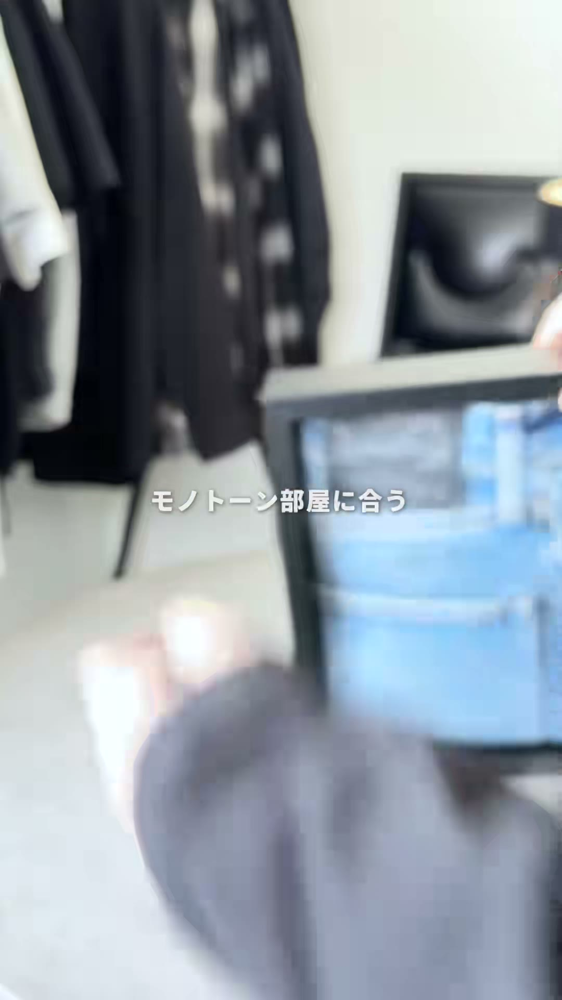

# ICHi式

【リソース】TikTokの@ichiroomvlog(ICHi)

インテリア・DIY系の投稿から、動画の作り方(構成・撮影・ナレーション)を分析した記録。しゃべってる内容(ノウハウ)そのものではなく、「どう作る・どう撮る・どう語るか」の型を抜き出すのが目的。新しい分析ほど上に追加する。

---

## デニムポスターDIY(2026-09-22分析)

【リソース】動画: https://www.tiktok.com/@ichiroomvlog/video/7544704847531085073(2025-08-31投稿)

### 構成(フック→展開→オチ、編集テンポ)
- **フック(0〜1秒)**: 完成品(インテリアフレーム)をいきなり見せて「オシャレ過ぎる」という強い字幕で惹きつける。結果(After)を先出しするパターン。
- **展開(2〜35秒)**: 制作過程(フレームのサイズに合わせてボードを切る、など)を字幕付きで手順順に見せる。
- **オチ/CTA(35〜41秒)**: 完成品をもう一度映して「用意したアイテムの詳細は概要欄に↓」で締める。購買導線への誘導が「オチ」の役割。
- **編集テンポ**: 全体41秒でカット28回(平均1.4秒に1回)。開始直後(1.2秒)にはもう1回目のカットが入るほど速いテンポ。

### 撮影(構図・画角・カメラワーク・背景)
- **構図・画角**: 完成品を見せるカット(冒頭・ラスト)は正面固定・対称構図の「商品ショット」。手元作業のカットは真上からの俯瞰(トップダウン)で、何をしてるか一目で分かる画角。
- **カメラワーク**: 場面転換であえて速いパンを使い、モーションブラーが出るくらいテンポよく振っている。静止画の羅列にならないための工夫。
- **背景・美術**: 黒・グレー・白で統一されたモノトーンの部屋。字幕でも「モノトーン部屋に合う」と明言していて、背景そのものが商品を引き立てるスタイリングとして機能している。
- **見せ方の工夫**: 完成品を額縁に入れて壁掛け風に見せ、鍵・サングラスなど小物を添えて「使用イメージ」を演出している。

#### 再現するための撮影のコツ

1. **商品ショット(完成品)は目線の高さ・水平固定**: 冒頭とラストの完成品カットは、カメラを商品と同じ高さに水平に構えて正面から撮ってる。三脚やスマホスタンドで固定すると再現しやすい。商品より暗い色(このケースは黒いフレーム)を使い、背景(白い壁)とのコントラストで商品を浮き立たせている。背景に「生活感のある小物」(ラグやアクセサリーラックなど)を1〜2個仕込むと、部屋の一部として見せる工夫にもなる。

   

2. **俯瞰(トップダウン)ショットは真上ではなく少し斜め**: 完全に真上(90度)ではなく、対象物のテーブルが画面に対して斜め(15〜30度くらい)傾いて写る角度で撮ってる。三脚で完全固定するより、スマホを片手で持って体ごと対象物に覆いかぶさるように構えると同じ雰囲気になる。手ブレが多少残る方が「作業感・臨場感」が出て自然に見える。手元作業は近距離(20〜30cm目安)、手とパーツが画面いっぱいに映るくらいスマホを近づける(広角のまま近づくと歪みやすいので、気になる場合は「1倍(標準)」カメラを使う)。

   

3. **速いパンは「体ごと半歩振る」感覚で**: 場面転換のパンは、腕だけでスマホを振るというより、体ごと軽く回転しながら振ってるようなブレ方をしてる。編集で速度を上げてる可能性もあるが、実際に素早く振ってから編集でさらにテンポを詰める、くらいの気持ちで撮ると近づけやすい。

   

4. **ブルーのネオンライン照明はアクセント用**: 商品自体を照らす主照明ではなく、背景の奥に置いて雰囲気作りだけに使ってる(USB給電のLEDネオンチューブなど、安価なもので再現できる)。主照明は自然光か部屋の照明で十分そうで、特別な機材は使ってなさそう。

### ナレーション(語りの構成・言い回し)
- **構成パターン**: 感想(フック)→きっかけ(共感)→準備物(最小限で列挙)→手順実況(接続詞で時系列を明確化)→仕上がりまとめ(対比・両立構文)→応用提案→CTA(概要欄誘導)、という順番。
- **言い回しの型**:
  - フックは「これは〇〇すぎる」+「今日は〇〇をやっていきます」のセット
  - 準備物は「〇〇と〇〇だけ」と絞って参入障壁の低さをアピール
  - 手順は「まずは」「次に」「そしたら」「最後」の接続詞で1手順=1短文で畳みかける、ですます調はほぼ使わない実況調
  - 仕上がりは「〇〇感は残しつつ、〇〇で統一」のような対比・両立構文でまとめる
